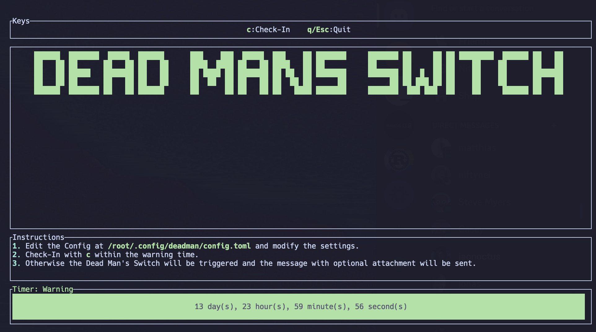

+++
title = "Sherlock Holmes Final Letter: A Simple Dead Man's Switch in Rust"
date = "2024-03-23T14:00:16"
author = "Jose Storopoli, PhD"

[taxonomies]
tags = ["rust", "nix", "privacy"]
+++


Got state secrets? Or maybe 50 BTC?
Don't trust your government or lawyers?
And you want to make sure that if you die, your secrets are passed on?
Don't worry, I got you covered.
In this post,
I'll introduce you to a **simple no-bullshit dead man's switch** written in Rust.

## Dead Man's Switch

According to [Wikipedia](https://en.wikipedia.org/wiki/Dead_man%27s_switch):

> A **dead man's switch** is a switch that is designed to be **activated or
> deactivated if the human operator becomes incapacitated**, such as through death,
> loss of consciousness, or being bodily removed from control.
> Originally applied to switches on a vehicle or machine,
> it has since come to be used to describe other intangible uses,
> as in **computer software**.

A Dead Man's Switch (DMS) can be handy and common scenarios might be:

- **Password to your encrypted files**: You gave a trusted person an encrypted
  USB drive and the DMS sends the password to decrypt it.
- **Bitcoin Multisig**: Sending 1 of 3 keys to a trusted person.
  You hold 1 key, your friend holds another key, and the DMS holds the last key.
- **Instructions**: Sending instructions on how to access something of value or
  importance.
- **Goodbye Note**: Sending a goodbye note to loved ones.

A DMS is specially useful when you don't trust the government or lawyers to
handle your affairs after you die.
It's also useful when you don't want to disclose your secrets while you are alive.

The idea is simple:

1. **You set up a DMS**.
1. **You need to check in periodically**.
1. **If you don't check in, the DMS is triggered**.

In this post opening picture, is depicted an image from Conan Doyle's story
[The Final Problem](https://en.wikipedia.org/wiki/The_Final_Problem),
where Sherlock Holmes fights Moriarty at the Reichenbach Falls.
Eventually, both fall to their deaths.
I am pretty confident that Sherlock Holmes had a DMS in place to send Watson
a message.

I've tried finding nice implementations of DMS, but to no avail.
They all were either unmaintained or plaged with spaghetti code.
My inspiration to build one came from two sources.
First, a friend of mine told me that he is using a bunch of badly-written
shell scripts with some cron jobs to manage his DMS.
Second, there might be a genuine need for a simple DMS in the privacy community.
For example, [finalmessage.io](https://finalmessage.io),
despite being closed source, and you have no idea who's behind it,
has gathered enough users in a subscription model and they are not accepting new
users anymore.
If people are paying for this, they can pay for a Linux server somewhere.
But they would need a simple DMS to run on it.

## How to Use It


Use at your own risk. Check the f\*\*\*\*(as in _friendly_) code.


I invite you to check out the code on GitHub at
[`storopoli/dead-man-switch`](https://github.com/storopoli/dead-man-switch).
The license is [AGPL-3.0](https://www.gnu.org/licenses/agpl-3.0.html),
which means you can use it for free as long as you share your code.
The package is also available on [crates.io](https://crates.io/crates/dead-man-switch),
Rust's package manager.

DMS is very easy to use and deploy.
There are several alternatives on how to deploy it.
Here are the two easiest ways:

1. **Building from Source**:

   1. In a fresh Debian/Ubuntu server install the following dependencies:

      ```bash
      sudo apt-get install -y cargo pkg-config libssl-dev
      ```

   1. Install the DMS:

      ```bash
      cargo install dead-man-switch-tui
      ```

   1. Run the app with:

      ```bash
      dead-man-switch-tui
      ```

1. **Using Nix**. This is the easiest just do
   `nix run github:storopoli/dead-man-switch`.

> [](<$block.attrs('info')>)
> I've also released a Web Interface for the dead-man-switch.
> You can easily deploy it using Docker or Docker Compose.
> Check out the [GitHub repository](https://github.com/storopoli/dead-man-switch).
>
> I've also launched a [StartOS](https://start9.com) app with a simple interface
> for configuring and checking in with the Dead Man's Switch.
> Check out the instructions on the
> [`dead-man-switch-startos` repository](https://github.com/storopoli/dead-man-switch-startos).

Once, you successfully run the app, you will see the following output:



If you read the instructions carefully, all you need to know is detailed in
these 3 steps:

1. Edit the Config at `/root/.config/deadman/config.toml` and modify the settings.
1. Check-In with `c` within the warning time.
1. Otherwise the Dead Man's Switch will be triggered and the message with
   optional attachment will be sent.

Upon the first run, the app will create a configuration file at an OS-agnostic
config file location:

- Linux: `$XDG_CONFIG_HOME`, i.e. `$HOME/.config|/home/alice/.config`
- macOS: `$HOME/Library/Application Support`, i.e. `/Users/Alice/Library/Application Support`
- Windows: `{FOLDERID_RoamingAppData}`, i.e. `C:\Users\Alice\AppData\Roaming`

In this example, I am running it from a Debian server as the `root` user.
Hence, the configuration file is at `/root/.config/deadman/config.toml`.

If you open the configuration file, you will see the following content.
I've added some default values for inspiration[^central-park]:

> [](<$block.attrs('info')>)
> Please don't go to bench 137 in Central Park, NY.
> That was just an example.

```toml
username = "me@example.com"
password = ""
smtp_server = "smtp.example.com"
smtp_port = 587
message = "I'm probably dead, go to Central Park NY under bench #137 you'll find an age-encrypted drive. Password is our favorite music in Pascal case."
message_warning = "Hey, you haven't checked in for a while. Are you okay?"
subject = "[URGENT] Something Happened to Me!"
subject_warning = "[URGENT] You need to check in!"
to = "someone@example.com"
from = "me@example.com"
timer_warning = 1209600
timer_dead_man = 604800
```

The configs are self-explanatory.
You might need some help to set up and find a reliable SMTP server.
One option is to use Gmail.
Unfortunately, Proton or Tutanota are not supported because they don't support
SMTP.
Just grab the support page of your email provider and search for SMTP settings.
Plug the values in and you are good to go.

I want to bring your attention to the **`timer_warning`** and **`timer_dead_man`**
configs.
These are very important.

The way DMS works is by **checking in periodically**.
If you **_don't_ check in within the `timer_warning` time,
the DMS will send a warning message to your own email**, i.e. the `from` email declared in
the config, with the message `message_warning`
and subject `subject_warning`.

If you **_still don't check in_ within the `timer_dead_man` time,
the DMS will send the "Dead Man's" message to the `to` email declared in the
config**,
with the message `message` and subject `subject`.

The timers are in **seconds**, and the **default values** are:

- **Warning Timer**: 2 weeks
- **Dead Man's Timer**: 1 week

Feel free to change these values to your liking.

You can also add an attachment to the Dead Man's Message.
Just add an `attachment` field to the config file with the _absolute_ path
to the file.
For example:

```toml
attachment = "/root/important_file.txt"
```

A good idea is to make this file encrypted.
Actually, it's even better if you encrypted the whole fucking thing.
You can use [PGP](https://gnupg.org/) or [`age`](https://age-encryption.org).
For example, this is a PGP-encrypted message:

```
-----BEGIN PGP MESSAGE-----

jA0ECQMKDpTufzWBF+//0ukBT/vslTBHGlMeri/cqpkxO2X7ZY1SYwiYwDqvdFAV
FGzPHUaGh8tQiuoh7tj0HJEIqBaktJoDNe3XsszFVSp3eQAAiWUh+t/5pTIcQhW9
iKJHPUKGhqf9vg0Q4LS0F1RMhLejoeXt/TvtHfsHE+kymbvp8p5gNiwoyugEZlta
qLd0ZJvMDg5c0/Qw81+e6jW0ApwcT7MVf/Y0dFKW1epsA1QfGH5rQYUWPJDP+SZR
hBd5034eKNKTUZYwAAoR0UJ6eqcnev9z9sTuct3uGPeXnNqK0zDKaP3rV/9hnVPN
3gwEQEWL2Dl39pjv+x+QdViCirlrjPa0BaHzwveid2N8Ik3QBsxKGkyAXd0w3G+g
VAGwKDLUkXUIDytk/PI8vRGLUhSmyG29KdeGdEiKde+DG5MUtjC4UyFCWxa5ZX5y
WNEg7049bd5Nx3B5WlFmKyWbsHynoziDJU2aq2uvaBLYA48roDN/0sEUsuGFpxm3
0/3vd0kGxMt20HlsVpDRQz75mWJEmzxY2itRJbR84bEyN0ItWE9G5WwQ4mjmU+XL
0xYazglNYoAG0FXCxD6EpbDbQZxO/OKIaGWI4d2Zs1zcwbcEfZnhsKB5kI4tYJZ2
ZTq+Q4xY4sFEoYzmNQbHY+mpgskgmHbRdBAGea+raiAXK/wL4Qc9x1bDdNIKNBup
lsCRA1Dj/5s0Qy64d2cbfWvCvx3R9B0JsHTcFq4DBELSOzSyzC/mpCXCAi9K/jE5
5VAnsnqaTZm+DVpciMTRxuRPD50MDYogTA/N+Jer9WmQOgc0e1VrWsho2CgX0Z8I
ycF56Wm+lBjTGRMLXexA1Ietm88wg/OrY6BE57xpBMVemRc0P0A2g0KC1WkX8J3I
fw5IKoiGsd9mvuHNxJ40Rm14iTYV0z9t97GFTmWji5BZtKoQ8vNmy8skgEgEUuHS
LtwCU8D5XsHQY2EWsQv23KPyxpbdvl7vGP75xCzRqcWmeCMSyH1qYPsO87sPJ4eL
Z4ywlr9ULagMgNMK/KO7F45yJRCqGKCaYB3cpcEpgUIIlZRCiXZSUifb/0EMWNAb
DzV/otFp8aMrhwGxIEYv1wOmot9OrBRVgLVSNTU9EtJVzISEowbhe+7ZP1jUaAaW
WrjvDA==
=cfGG
-----END PGP MESSAGE-----
```

In this message there's a nice Easter Egg for you, my friend.
The password is the name of the waterfall depicted in this post,
all together and in PascalCase.

Upon checking in, the timer will be reset to the Warning Timer,
even if you are already in the Dead Man's Timer.

If both timers run out, the messages will be sent and DMS will exit.

## The Implementation Details


For the stupid smelly nerds that want to go beyond the
["JUST MAKE A FUCKING .EXE AND GIVE IT TO ME"](https://github.com/sherlock-project/sherlock/issues/2019).


Before we dive into the code, here are the **dependencies** that I am using.
I've tried to keep them to a minimum, since I want this to be a dead-simple
program.
This also helps with reducing the incidence of bugs and narrowing the
attack surface:

- [`ratatui`](https://ratatui.rs) for the Terminal User Interface (TUI)
- [`serde`](https://serde.rs), [`toml`](https://crates.io/crates/toml),
  and [`directories-next`](https://crates.io/crates/directories-next)
  for managing the TOML configuration file.
- [`lettre`](https://lettre.rs) to manage email sending,
  and [`mime_guess`](https://crates.io/crates/mime_guess) to robustly
  handle optional attachments.
- [`chrono`](https://crates.io/crates/chrono) to handle timers and date/time
  formatting.

> [](<$block.attrs('info')>)
> The Dead Man's Switch Web Interface uses [`axum`](https://github.com/tokio-rs/axum),
> [`askama`](https://djc.github.io/askama/) and [`tower`](https://github.com/tower-rs/tower).

The app is divided into a library and a binary.
The library is contained in the `lib.rs` file and the binary in the `main.rs`,
both under the `src/` directory.
Here's a representation of the structure of `src/`:

```bash
src/
├── config.rs
├── email.rs
├── lib.rs
├── main.rs
├── timer.rs
└── tui.rs
```

As we can see, it is divided into 4 modules:

- **`config.rs`**: Handles the configuration file.
- **`email.rs`**: Handles the email sending.
- **`timer.rs`**: Handles the timers and timer logic.
- **`tui.rs`**: Handles the Terminal User Interface (TUI).

Feel free to dive in any of these files to understand the implementation details.
I've made sure that the code is _both_ **well-tested** and **well-documented**.

## Contributions are Welcome

If you want to contribute to the project, feel free to open a pull request.
I've marked a few issues as `good first issue` to help you get started.
Check out the [GitHub repository](https://github.com/storopoli/dead-man-switch).

## Conclusion

I've built a simple no-bullshit Dead Man's Switch so that any person can use it.
Feel free to use it and share it with your friends.
Let's hope that we don't go to a dystopian future where everyone needs to use it.
Although, I am pretty sure that Sherlock Holmes would have used it no matter what.
Probably the way he would have used it is by:

1. Set-up a non-KYC email account that supports SMTP.
1. Sign-up for a non-KYC VPS with Bitcoin or Monero.
1. Access the VPS via Tor using Tails.
1. Change the server's default SSH port to a random one.
1. Disallow password authentication and only allow key-based authentication.
1. Encrypt everything in the case the server is seized.


Sherlock could also use a coreboot non-KYC piece of hardware that
runs StartOS and the newly launched Dead Man's Switch StartOS app that already
uses an onion service for handling the check-ins via Tor.

