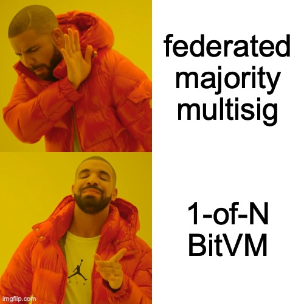
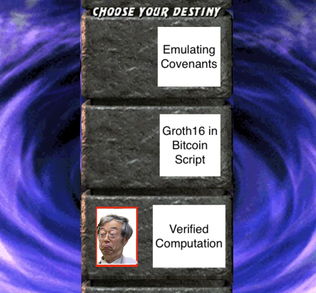
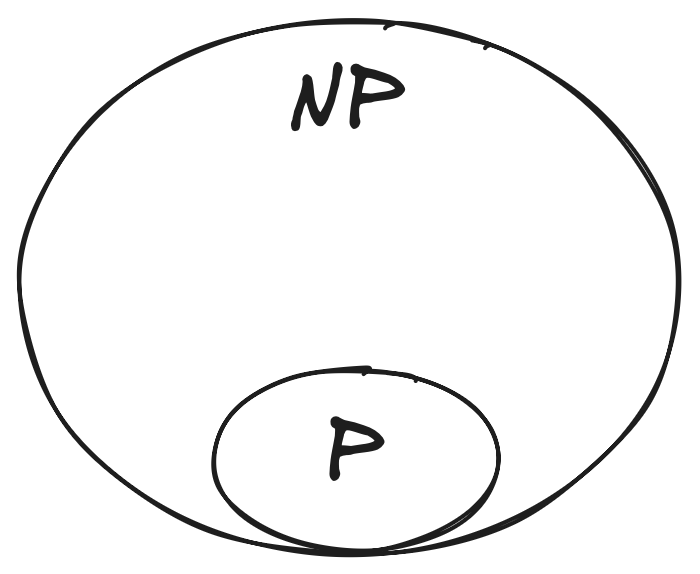
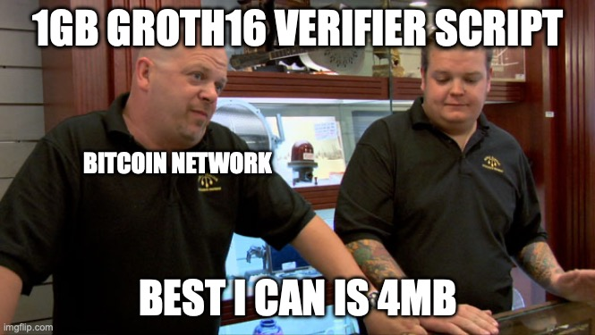
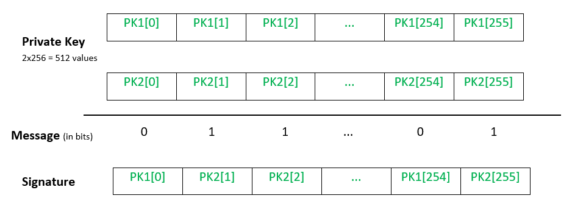
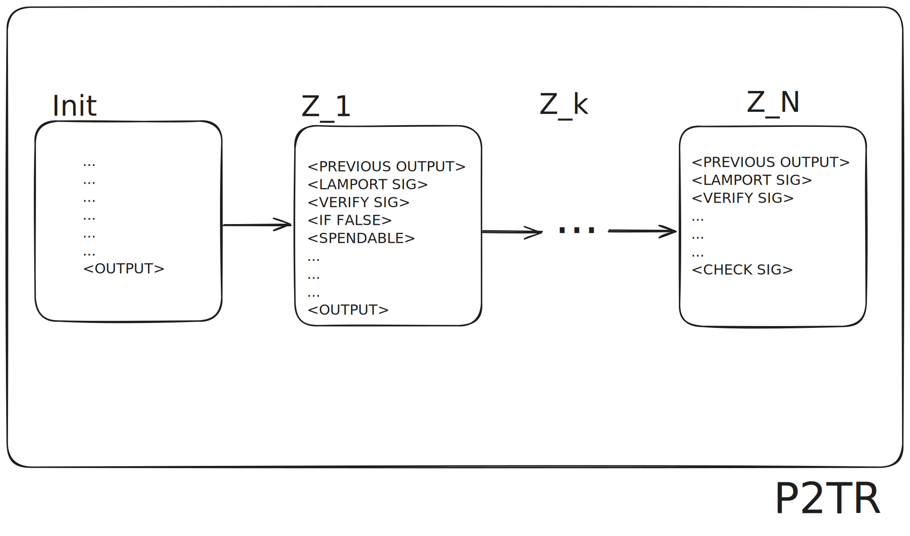

+++
title = "BitVM: How to bridge using 1-of-N trust assumptions"
date = "2025-02-10T04:57:00"
author = "Jose Storopoli, PhD"

[taxonomies]
tags = ["math", "cryptography", "bitcoin"]

[extra]
katex = true
mermaid = true
+++


This post uses [KaTeX](https://katex.org/) to render mathematical expressions
and [Mermaid](https://mermaid.js.org) to render flowcharts.

To see the rendered content, you'll need to enable JavaScript.



This post is the written version of my very condensed 45-minute talk
at [BTC++ 2025 Floripa](https://btcpp.dev/conf/floripa).
You can watch the talk [here](https://youtu.be/gHoSpAgI7Xk).

{{ youtube(id="gHoSpAgI7Xk") }}


**BitVM is a bridge between Bitcoin and a sidesystem**.
Generally, these bridges are secured by a federated multisig,
where to bridge-out you need to have a majority of the federation.
Mathematically, this is a $(\frac{N}{2}+1)$-of-$N$ trust model.
This is not ideal since it's a "trust me bro" situation and the "bros"
are the majority of the bridge.
BitVM is different, since it can drastically reduce the trust assumptions.
It is a **$1$-of-$N$ trust model, in which as long as you have one live honest operator,
you can withdraw on-chain**.

I am part of the **[Alpen Labs](https://alpenlabs.io) engineering team
that is building [Strata: a BitVM-based rollup on Bitcoin](https://stratabtc.org)**.
Strata is also part of the [BitVM Alliance](https://bitvm.org/):
a partnership to accelerate the development and implementation of BitVM project.

This post has a lot of overlaps with my previous post on
["Some Intuitions on Zero-Knowledge Proofs"](@/blog/2024-06-08-zkp/index.md).
If you want to know more about Zero-Knowledge Proofs (ZKPs),
then I'd suggest you read that post first.


This post is filled with external links and footnotes.
If you want to dive deeper into any topic that has one of these,
feel free to do so.
The idea was to give a general overview the concepts,
while also allowing you to tune your experience by giving you
a bunch of tangents and rabbit holes to explore if wanted.


I'm going to present BitVM in it's main three big ideas:

1. **Verified Computation**
2. **Groth16 Bitcoin Script Compiler**
3. **Emulating Covenants with Connector Outputs**

The only new idea that BitVM brings to the table is the Groth16 Bitcoin script compiler.
Verified computation is the premise of ZK-SNARKs,
and emulating covenants with connector outputs was already used by the
[Ark protocol](https://ark-protocol.org/).

## Big Idea 1: Verified Computation

Suppose you have a function that does some complicated stuff and performs some computation.
Then, this function can be represented as an [**arithmetic circuit**](https://en.wikipedia.org/wiki/Arithmetic_circuit)[^peano].

[^peano]:
    If you want to dig yourself into a very nice rabbit hole,
    check [Peano arithmetic](https://en.wikipedia.org/wiki/Peano_axioms)
    and [Turing-completeness relations](https://en.wikipedia.org/wiki/Turing_completeness).

An arithmetic circuit is a directed acyclic graph (DAG) where:

- Every indegree-zero node is an input gate that represents a variable $x_i$
- Every node with indegree $>1$ is either:
  - an addition gate, $+$, that represents the sum of its children
  - a multiplication gate, $\times$, that represents the product of its children

Here's an example of an arithmetic circuit that represents the function

$$f(x_1, x_2) = x_1 \cdot x_2 + x_1$$


flowchart TD
x1["x₁"]
x2["x₂"]
mul["×"]
add["\+"]

x1 --> mul
x2 --> mul
mul --> add
x1 --> add


In the circuit above, the input gates are
$x_1$ and $x_{2}$,
the product gate computes $x_1 \cdot x_2$,
and the sum gate computes the result of the product gate added to $x_1$.
All of this evaluates to $x_1 \cdot x_2 + x_1$.

This stems due to the fact that any [NP problem](<https://en.wikipedia.org/wiki/NP_(complexity)>)[^np-complete]
can be reduced in polynomial time by a deterministic Turing machine to
the [Boolean satisfiability problem](https://en.wikipedia.org/wiki/Boolean_satisfiability_problem)[^boolean-funs].
This is known as the [Cook-Levin theorem](https://en.wikipedia.org/wiki/Cook–Levin_theorem),
and it is a fundamental result in theoretical computer science.

[^np-complete]: Actually, it is any NP-complete problem, but without loss of generality, we'll focus on NP.

[^boolean-funs]: Note that you can represent addition and multiplication as Boolean functions.

In computer science, we have two main classes of problems:

- $\cal{P}$ problems, which are **easy to solve and verify**.
- $\cal{NP}$ problems, which are **hard to solve, but _easy_ to verify**.

$\cal{P}$ stems from polynomial time,
and contains all decision problems that can be solved by a deterministic Turing machine
using a polynomial amount of computation time, or polynomial time.
$\cal{NP}$ stems from non-deterministic polynomial time,
and is the set of decision problems for which the problem instances,
where the answer is "yes", have proofs verifiable in polynomial time by
a deterministic Turing machine.

According to the Cook-Levin theorem,
once you find an algorithm that solves one of the $\cal{NP}$ problems
in polynomial time, you can use it to solve **_any_ $\cal{NP}$ problem
in polynomial time**.
But we haven't yet found such algorithms for any $\cal{NP}$ problem.
Heck, we don't even know if $\cal{P} \ne \cal{NP}$.
It is highly speculated, but yet still an open question[^millennium-problems].

[^millennium-problems]:
    If you solve this conjecture either by proving it or disproving it,
    you'll be up for a [1 million USD prize](https://en.wikipedia.org/wiki/Millennium_Prize_Problems).
    I like to say that it is the hardest way to
    earn 1 million USD.

Moving on, **any (finite) arithmetic circuit can be transformed
into a big (finite) polynomial**,
by using techniques such as
[Rank-1 Constraint System (R1CS), quadratic arithmetic program (QAP)](https://alinush.github.io/qap-r1cs);
and many others.
This means that we can map any arithmetic circuit to a polynomial,
and vice-versa; and one operation in each side of the map,
can be mapped to a single operation in the other side.

Finally, we can **cryptographically commit to a polynomial using
[polynomial commitment schemes (PCS)](https://en.wikipedia.org/wiki/Commitment_scheme#KZG_commitment)**.
This means that we **also commit to a certain arithmetic circuit,
given that we know the unique polynomial that it represents**.
This commitment allow us to create **very succinct zero-knowledge proofs
that some computation was performed given certain inputs**.
We can represent this with proof as $\pi$
which takes as public-accessible inputs $x$,
and private-accessible inputs $w$ (as in witness),
and outputs $y$:

$$\pi(x; w) = y$$

Let's define verifier $V$ that has access to the arithmetic circuit $C$,
the inputs $x$, and the proof $\pi$.
Note that $V$ does not have access to the witness $w$, which are private inputs.
Additionally, $V$ may or may not have access to the output $y$ of the whole computation.
Also, we'll define a prover $P$ that has access to everything $V$ has,
with the addition of the witness $w$.

This proof $\pi$ has three main properties:

1. **Completeness**: If the statement is true, the verifier will accept the proof.

   $$ \Pr\big[V(\pi, x) = \text{accept} \big] = 1. $$

   Here $\Pr\big[V(\pi(x)) = \text{accept} \big]$
   denotes the probability that the verifier accepts the proof given
   a proof $\pi$, and inputs $x$.

1. **Soundness**: If the statement is _false_, no cheating prover
   can convince an honest verifier that it is true,
   except with some negligible probability [^negligible].

   $$
    \forall A, \forall x, \forall \pi: \Pr\big[V(A, \pi, x) =
    \text{accept} \big] < \text{negligible}.
   $$

   Here $\Pr\big[V(A, \pi) = \text{accept} \big]$ denotes
   the probability that the verifier accepts the proof given an adversary $A$,
   a proof $\pi$, and _public_ inputs $x$.

1. **Zero-Knowledge**: If the statement is true,
   the verifier learns nothing about the secret $w$.

[^negligible]:
    A function $f$ is negligible if for every polynomial $p$,
    there exists an $N$ such that for all $n > N$,
    $$ f(n) < \frac{1}{p(n)}. $$
    If you want to learn more about negligible functions,
    read Chapter 3, Section 3.1 of the book [Introduction to Modern Cryptography](https://doi.org/10.1201/9781420010756) by Katz & Lindell.

There are many commitment schemes,
even ones that don't use polynomials.
But a succinct zero knowledge system also needs an
interactive oracle proof (IOP).
One of such schemes is [Groth16](https://alinush.github.io/groth16),
named after Jens Groth,
who published the [paper describing it in 2016](https://eprint.iacr.org/2016/260).

**Groth16 uses a mathematical tool called
[bilinear maps](https://en.wikipedia.org/wiki/Bilinear_map)
or [pairing functions](https://alinush.github.io/pairings)**.
This is generally applied to vector spaces,
but they can work in elliptic curves (EC) as well.
It allows us to have VERY succinct proofs.
I'm not gonna cover the math behind EC pairings.
Instead, suffices to know that an EC pairing,
given three groups $G_1$, $G_2$, and $G_T$ (as in target group),
is a function $e$:

$$e: G_1 \times G_2 \rightarrow G_T$$

In other words, it takes any two elements in $G_1$ and $G_2$;
and outputs a group element in $G_T$.

**Groth16 proofs are very succinct**.
It consists of 3 group elements
(2 from $G_1$ and 1 from $G_2$) which amounts **from 128 to 192 bytes**.

As an example suppose that I know how to calculate the 100th million digit of $\pi$.
I publicly produce a VERY big arithmetic circuit,
and cryptographically commit to it using a polynomial commitment scheme.
I proceed by performing the HUGE computation, and sending to you, the prover,
$x$ and $\pi$: the inputs to this circuit and the proof
that I've performed the computation correctly.
By verifying the proof, you can convince yourself that I know the
100th million digit of $\pi$ without gaining any knowledge of this digit at all.

In fact, to classify as **succinct**, this proving system must
output proofs that are **at most poly-logarithmic** in the size of the circuit $C$,
denoted as $|C|$,
that it was committed and used to perform the computation
that the prover wants to prove.
Additionally, the verification time must also be poly-logarithmic in $C$.
This means that **both the proof size
and verification time complexity must be at most**:

$$O(\log^k |C|)$$

for some constant $k>1$.

Since Groth16, outputs proofs that are between 128 and 192 bytes,
and also has a **constant-time verification**,
due to the face that it is just checking 3 group elements,
irrespectively of the size of the circuit $C$,
then **Groth16 is a succinct zero-knowledge proof system**.
In fact, it is currently the most succinct one that we know so far[^research].

[^research]:
    Note that ZK-SNARKs and succinct proving systems in general are a very hot research topic.
    We might find succincter systems in the future.

This is something quite marvelous.
Imagine that you have ANY computation whatsoever,
and I can prove to you that I've done it
by sending only a very succinct ~200-byte proof
and you are completely convinced that I did it.
This is called **[verifiable computing](https://en.wikipedia.org/wiki/Verifiable_computing)**,
which crypto-bros call "zero-knowledge".
We already have zero-knowledge in classical cryptography:
"Hey I know a secret key and here's a signature to prove to you".
But the real novelty here is that **we can prove that I did a computation
without revealing the computation itself**.

To finalize, there are some caveats in using Groth16.
Yes, we have the **best ZK-SNARK in terms of proof size
and verification time**.
However, the setup is what we call a **"trusted setup" that is also non-universal**.
This means that we need some sort of ceremony to setup the protocol,
which includes the prover and verifier keys.
This can be done in a Multi-Party Computation (MPC) style,
with several parties joining the ceremony.
Each one of these parties will contribute with some random secret data
towards the setup of the protocol.
**As long as one of them throw away their secret data,
the protocol is secure**[^ceremony].
This means that no one can prove false statements
or make a proof for a computation that was not performed.
Additionally, the setup is done for a single circuit.
Hence, you can only prove stuff that was done in a simple computation context.
You can vary the inputs as much as you like, but the circuit will always be the same.
To get a different circuit using Groth16, you need to perform a new setup.

[^ceremony]:
    In the infamous Zcash setup ceremony, Peter Todd,
    one of the participants, "ran all of his computations on a laptop encased
    in a tin foil-lined cardboard box, while driving across Canada.
    He then burned his compute node to a crisp with a propane torch".
    [Source](https://spectrum.ieee.org/the-crazy-security-behind-the-birth-of-zcash)

## Big Idea 2: Groth16 Bitcoin Script Compiler

The second big idea is to **overcome Bitcoin's Script limitations
by creating a Groth16 verifier using Bitcoin Script**.

**Bitcoin Script** is VERY limited.
It is a **stack-based language, and it has a very limited number of opcodes
that pops and pushes values into the stack; or manipulates the stack**.

Most opcodes deal with verifying signatures since that is the most
common usecase for Bitcoin Script.
However, Bitcoin Script can also do some things such as:
**hashing values and checking equality**.
Additionally, we also have an **alternate stack, called "alt stack",
which is kinda a buffer for storing values**.

With respect to math operations we have, hold your breath,
**_only_ 32-bit addition and subtraction**.
We don't have multiplication and division,
modular division, or bit-rotations.
Heck, we cannot even _concatenate_ two values into a single one.
This has some historical reasons,
and the short story is that Satoshi was scared
of people torpedoing the network by exploding the stack,
and eventually crashing nodes by using these "dark arts" arithmetic operations.
The network was in its early days,
and very fragile.
Instead of carefully setting guard-rails so that
people don't do stupid dangerous things,
he pretty much **disabled[^satoshi-commit] all the "dark arts" arithmetic operations**.

[^satoshi-commit]:
    Check L94-L109 in `script.cpp` in this
    [2010 commit](https://github.com/bitcoin/bitcoin/commit/4bd188c4383d6e614e18f79dc337fbabe8464c82) from Satoshi.

Bitcoin Script is different than Ethereum's EVM.
In the EVM, you can do whatever you want.
It is (bounded) Turing-complete.
You just need to make sure that you have enough gas
to pay for the computation.
However in Bitcoin, the fees are calculated from the transaction size.
This is possible because of the very limited expressiveness that Bitcoin Script has.
All nodes will run your transaction's Script and verify it
irrespectively of the size of the Script,
within the relevant size limits, of course.

Bitcoin, prior to the Taproot upgrade,
had limitations to a maximum of 1,000 stack elements,
and 201 opcodes per program.
With Taproot, we don't have more opcodes limitations,
but the 1,000 stack elements limitation is still there.

Remember that to **verify a Groth16 proof we need to do some elliptic curve pairings
and check 3 group elements**?
This means that, technically, we can have a Groth16 verifier in Bitcoin Script.
Just like the golden rule of JavaScript: "if something can be built using JavaScript,
it WILL be built using JavaScript";
we can tweak it to be the **golden rule of Bitcoin Script:
"if something can be built using Bitcoin Script,
it WILL be built using Bitcoin Script"**.
To achieve a Groth16 verifier in Bitcoin Script,
we just need to be **able to do 256-bit multiplication
using only 32-bit addition operations**.
And without the 201-opcodes limitation,
that Taproot upgrade, **we can have a Groth16 verifier in Bitcoin Script**.

It turns out that this Script is kinda big.
**If you put it in a single transaction,
it will be around 1GB**.
Not cool! Even if we are BFF with some miners,
to not be limited by the transaction standardness requirements[^transaction-standardness],
we can't propagate this transaction since it will never fit a block
which must be at most 4MB.

[^transaction-standardness]:
    Transaction standardness means that a transaction will be accepted by every node in the network.
    This requires that the transaction is at most 400kvb (that's kilo "virtual" bytes),
    and has only one `OP_RETURN` output with at most 80-bytes of data.
    If you want to do crazy stuff, like `>400kvb` or more than one `OP_RETURN` output,
    you need to call your friendly neighborhood miner and ask them to include directly into their next block,
    without having to relay through the Bitcoin network (since no node will accept it).

The next step stems from the insight that **to find a fault in a Groth16 proof,
we need to find at least one step of the proof verification execution that it fails**.
If we find none, then we can be sure that the proof is valid.
Maybe we could somehow **split this 1GB huge Bitcoin Script into smaller scripts**,
that could be **published in a block** or even **relayed by nodes** if we can get
it to fit the standardness requirements[^transaction-standardness].

We have merkle trees in the Taproot upgrade,
so what if we could split the Groth16 proof verification into a bunch of
script spending paths (leaves in the Taproot Merkle tree),
then we just need to find at least one leaf that the proof fails.
If we cannot find any, then we can be sure that the proof is valid.

But, wait! Bitcoin Script is stateless!
We cannot pass state from one transaction to the next transaction.
Is it? Well, this is the final trick needed to fit
the 1GB Groth16 verifier Bitcoin Script into a bunch of
standard[^transaction-standardness] transactions.
We know that Bitcoin Script, despite its limitations, can hash stuff and verify equality.
Hence, we need to find a primitive that can carry data with some sort of authentication;
and uses exclusively hash functions.

This is where **hash-based one-time signatures (OTS)** comes into play.
The first, and most famous, OTS is
the **[Lamport signature](https://en.wikipedia.org/wiki/Lamport_signature)**,
which was invented by [Leslie Lamport](https://en.wikipedia.org/wiki/Leslie_Lamport)
in 1979.
Suppose that what you're signing is a 256-bit hash $H(m)$ of a message $m$.
The way Lamport signatures work is that your public key is
the 256 pairs of hashes: 512 in total.
The first pair represents all possible `0`s that a 256-bit hash can have;
and the second pair the same for all possible `1`s.
To sign $H(m)$, you just reveal a preimage for each pair
depending on the bit of the $H(m)$.
Remember that a bit can be only 0 or 1 (a single pair).
If your bit index `i` is `0` you reveal the preimage for
the public key's first pair at index `i`, that represents `0`s;
if it's `1`, you reveal the preimage for
the second pair at index `i`.
This is a one-time signature, since you literally reveal a good chunk
of your private key while signing.

Below is a visual representation of the Lamport signature.
Everything is represented as bits, being either `0` or `1`.
As you can see, in the top, we have the pair of hashes as public keys,
`PK1` and `PK2`.
In the middle, we have the message that we are signing.
Finally, at the bottom, we have the signature which reveals
the preimages for the public keys depending on what value of the message
for each bit in the message.

Since the Groth16 proof is based mostly on 256-bit group elements,
we can **pass the state from one script to the next script
by hashing the final state of the computation and continuing
in the next script with the hash as the input**.
We can avoid tampering since these hashes (the message)
are signed.
Also, we only need one Lamport public key since it is fine to reuse
mostly because the whole batch of transactions will be in the same
Taproot Merkle Tree of Scripts.
This technique is called **bitcommitments**.

The image below shows a P2TR address with a Groth16 verifier in it.
All of the scripts inside the Merkle tree of script spending paths
are below 400kb, and have a 1,000 stack elements limit.
So they adhere to standardness requirements[^transaction-standardness].
The first script is the `Init`: it grabs some inputs from the witness,
and performs some computations and results in an output
that will be used in the `Z_1` script.
How we pass the state from the `Init` script to the `Z_1` script
is by using Lamport signatures[^winternitz].
From there we keep performing computations and passing the state
from `Z_2` until `Z_N`.
If we get to the last script `Z_N`, then we just lock it with
the prover's public key so that only him can spend this P2TR address.
Each `Z_k` for any `k <= N` that uses previous outputs as inputs
have a Lamport signature verification procedure in Bitcoin script
that if fails will make the script spendable by anyone.

[^winternitz]:
    Lamport signatures are very inefficient.
    Teams building BitVM-based bridge generally use [Winternitz signatures](https://asecuritysite.com/encryption/wint) instead.

Remember that all of these scripts are inside a P2TR Merkle tree.
Hence unlocking only one of them suffices to spend the whole P2TR UTXO.
**If the prover is honest and has a valid proof, then only he can spend the UTXO.
However, if the prover is dishonest and has a invalid proof,
then anyone can spend the UTXO by simply finding at least one
leaf script that the Lamport signature verification fails**.

I am not putting the specific opcodes here,
because the goal is to give a high-level overview of
how we can insert a Groth16 verifier in Bitcoin Script.
If you want to learn more about how a ZK-SNARK verifier can be included
in a Taproot address,
check the [BitVM2 paper](https://bitvm.org/bitvm_bridge.pdf).

## Big Idea 3: Emulating Covenants with Connector Outputs

The next big idea is to **emulate covenants with connector outputs
and pre-signed transactions (and timelocks)**.
This is not new since the [Ark protocol already used connectors](https://ark-protocol.org/intro/connectors/index.html)
to emulate covenants.

First let's tackle what are covenants.
**[Covenants](https://bitcoinops.org/en/topics/covenants/)**
are a category of proposed changes to Bitcoin’s consensus rules that would allow
a script to prevent an authorized spender from spending to certain other scripts[^timelocks].
A very useful example is the [`OP_VAULT`](https://jameso.be/vaults.pdf)
that allows an UTXO to be only spent to a specific destination.
There are many other proposals like this.

[^timelocks]:
    In a sense absolute and relative timelocks are a sort of covenant.
    Hence, Bitcoin already has at least one kind of covenant: timelocks.

Ok, but we don't have covenants in Bitcoin.
Hence, we need to **emulate some sort of transaction introspection**.
This is where the BitVM bridge comes in:
the part of the protocol that creates a **transaction graph made of pre-signed transactions**.
These pre-signed transactions are signed by **every operator in the $N$ operators bridge
in a way that every operator has his own pre-signed version of the transaction graph
by all other operators**.
This is important since it allows the **1-of-$N$ trust assumption**,
because any operator can use its pre-signed transaction graph to perform
a withdraw from the BitVM bridge into Bitcoin.

However, only having pre-signed transactions is not enough to emulate covenants.
We also need **connector outputs,
which are ways to restrict the flow of funds and information in a transaction graph**.

To illustrate this, let's consider a simple toy transaction graph example.
In the figure below, we have a transaction graph that has six transactions:

1. **Claim**
1. **Payout Optimistic**
1. **Challenge**
1. **Assert**
1. **Payout**
1. **Disprove**

This represents a "contract" between two parties, Alice, the verifier, and Bob, the prover.
Alice wants Bob to calculate the [three-quadrillionth digit of $\pi$](https://en.wikipedia.org/wiki/Pi#Modern_quest_for_more_digits)[^pi].
This can be any computation, but let's go with a nerdy example,
since these are always good mind seeds to sow over the internet.
And she's willing to pay $10$ BTC to Bob if he completes the task,
hence she deposits $10$ BTC into a P2TR address.
This P2TR address, all the transactions that stems from it,
are checked and pre-signed by both Alice and Bob.

[^pi]: Currently, the record stands at the two-quadrillionth digit.

Let's follow the flow of transactions.
The BTC denomitations are either $10$ BTC to demonstrate the flow of capital,
and $\emptyset$ to demonstrate the flow of information.
Bob, once ready, can spend Alice's $10$ BTC using the pre-signed Claim transaction.
It has two outputs:

1. A timelocked $10$ BTC output that can be spent using the Payout Optimistic transaction.
1. An empty output $\emptyset$ that can be spent using either the Payout Optimistic transaction
   or the Challenge transaction.

Notice that if Bob is honest and has produced a valid proof,
he can just spend both outputs using the Payout Optimistic transaction
and wait the timelock to get his $10$ BTC.
However, if Bob is dishonest by providing an invalid proof,
or even no proof at all, and by trying the Payout Optimistic transaction path,
Alice can say "fuck you" and spend the empty output $\emptyset$ using the Challenge transaction.
Now the Payout Optimistic transaction is invalid because one of the inputs was spent
and no miner would be able to include it in a block.

By challenging Bob,
Alice also needs to provide funds to cover for the cost of
asserting his proof on-chain; say $0.1$ BTC,
which is the cost of broadcasting the Assert transaction.
Now that Bob was challenged, the only viable path is to
assert his proof on-chain using the Assert followed by the Payout path.
The Assert transaction carries the $10$ BTC,
and inside it we have our Groth16 verifier, denoted as $G16$.
$G16$ will verify the proof provided by Bob,
using native Bitcoin Script and the big P2TR Merkle tree
that we've discussed above in [Big Idea 2](#big-idea-2-groth16-bitcoin-script-compiler).
If the proof is valid, then Bob can spend the $10$ BTC
using the Payout transaction that gives him the $10$ BTC back.
This has also a timelock to allow Alice to disprove Bob's proof.
If Alice cannot disprove Bob, he will eventually get his $10$ BTC back
by the Payout transaction.

However, if at least one of the leaves in the big P2TR Merkle tree inside the $G16$ is invalid,
then Alice can again say "fuck you" and spend the $10$ BTC
using the Disprove transaction that gives her the $10$ BTC back.

**This is a very clever way to emulate covenant-like behavior using
a pre-signed transaction graph that has connector outputs
that control the flows of both money and information**.

The reader can note that it is trivial to extend this
idea to any verified computation,
such as "I've got the proof that this withdrawal is valid because of some funds in a sidesystem that were burned".
And if the proof is valid, then the operator can have the withdrawal money back to
pay the user[^withdrawal].
And **if the proof is invalid, the operator then can have
some sort of collateral BTC slashed** with some small part being burned
and the **remainder being given to the challenger**.
Hence, we have **economic incentives** to make sure that **operators behave**
and, not only produce valid proofs, but also **challenge invalid ones**.
The whole system also allows for **operators to charge withdrawal fees**
from the sidesystem's users during the withdrawal process.

[^withdrawal]:
    In the actual BitVM bridge protocol,
    the operator outfront the withdrawal money to the user
    with some fee for the service,
    and then asks for the BitVM bridge for a refund.

## What can covenants bring to BitVM?

As I've said above, we don't have covenants yet in Bitcoin[^timelocks].
Nevertheless, the future is yet to be written
and one day we **might have covenants in Bitcoin**.
If, and that's a big if, we have covenants in Bitcoin, they can bring several benefits to BitVM:

- **The BitVM bridge becomes a [defacto Layer 2](https://petertodd.org/2024/covenant-dependent-layer-2-review)
  for Bitcoin by supporting unilateral trustless withdraws**.
- **The Groth16 verifier might not need to be chunked and split into multiple transactions or locking scripts,
  and could fit a single transaction**.
- **The sidesystem could be a true ZK-validity rollup, and not a ZK-optimistic rollup**.
  This allows a much stricter security model for the sidesystem.

Let's dive into the details of how covenants can enhance BitVM.

First, with something like **[`OP_CAT`](https://bitcoinops.org/en/topics/op_cat/)**
and **[`OP_CHECKTEMPLATEVERIFY`](https://bitcoinops.org/en/topics/op_checktemplateverify/)**;
also known as `OP_CTV`,
we don't need to have the whole transaction graph pre-signed by every operator.
We just need to use `OP_CTV` with some concatenation using `OP_CAT`
in the transactions to verify important parts of the transactions
that guarantee the integrity of the transaction with respect to the BitVM bridge.
Then, anyone can do a **unilateral trustless withdraw**, not only a single BitVM operator.
This will **turn the BitVM bridge into a
[fully trustless Bitcoin Layer 2](https://petertodd.org/2024/covenant-dependent-layer-2-review)**.

Second, using the **[Great Script Restoration (GSR)](https://brink.dev/blog/2024/08/22/eng-call-great-script-restoration/)**,
which is a proposal to **bring back all the "dark arts" arithmetic operations as 64-bit arithmetic operations**,
like multiplication (`OP_MUL`), division (`OP_DIV`), left shift (`OP_LSHIFT`), and right shift (`OP_RSHIFT`);
we can hugely improve the efficiency of BitVM's Bitcoin Script-native Groth16 verifier.
It may even **fit into a single standard[^transaction-standardness] transaction**.

Finally, using **both GSR and `OP_CAT`**, we can make the BitVM sidesystem;
the thing that we are using the bridge to bridge into from Bitcoin,
to **[become a ZK-validity rollup](https://ethereum.org/en/developers/docs/scaling/zk-rollups/)**.
This will hugely improve the security model of the BitVM sidesystem,
which now, not only inherits the reorg resistance of the Layer 1 blocks,
since any rollup derives (and writes) its state into the Layer 1,
but also inherits the consensus model of the Layer 1.
You cannot _opportunistically_ write the rollup state into Layer 1.
It is now fully verified by the Layer 1 consensus.
Hence, you don't need constant "eyes" on the rollup writes in Layer 1
to find frauds, as **the Layer 1 consensus guarantees the validity of the rollup state**.

## Conclusion

The focus of this post is to give a high-level overview of BitVM,
and building intuitions on how it works.
By using the 3 big ideas
we can create a very interesting 1-of-$N$ Bitcoin bridge,
instead of having to resort to outdated majority federated multisig bridges:

1. **Verified Computation**
2. **Groth16 Bitcoin Script Compiler**
3. **Emulating Covenants with Connector Outputs**

**This allows all kinds of exciting stuff to be built on top of Bitcoin**.
Bitcoin is already the **best money in the world**,
being the only ["sound money"](https://bitcoinmagazine.com/culture/history-bitcoin-sound-money-helps-society).
However, due to its limited scalability,
it is not suitable for wide adoption without
either resorting to Layer 2 solutions,
or by losing it's sound money properties by reducing the decentralization[^decentralization].
Additionally, Bitcoin is _not_ expressive enough to build interest applications.
Things like prediction markets, decentralized exchanges,
yield farming, Bitcoin-backed loans,
and more have been brought to Bitcoin and left deep traumas.
This is due to the fact that, while being possible to build smart contracts
that are transparent and can be audited in Ethereum & Co.,
in Bitcoin they came as a "trust me bro" solutions.
All of these usecases cannot be expressed using Bitcoin Script.
Hence, you need to fallback to losing custody of funds
to use these solutions.
Of course, shit hit the fan, and tons of people and companies lost A LOT of money
as these "trust me bro" solutions either were hacked or went belly up.
This might be a new dawn of BiFi (Bitcoin Finance, and fuck DeFi).

[^decentralization]:
    Decentralization is a key property of Bitcoin, and reducing it would compromise its sound money properties.
    This is due to the fact that any average Joe can run a node,
    since the requirements for running a node are minimal: 4MB every 10 minutes.
    If we increase the block size, or block time, we would increase the cost of running a node,
    which would reduce decentralization.

Of course, you need a LOT of engineering to implement BitVM.
If you are curious about the details, you can check out the
[BitVM repo](https://github.com/BitVM/BitVM) for the Groth16 compiler,
the [`strata-bridge`](https://github.com/alpenlabs/strata-bridge) repo
for the whole BitVM bridge transaction graph;
and finally, the [`strata`](https://github.com/alpenlabs/strata) repo
for the Strata rollup (the BitVM sidesystem).
