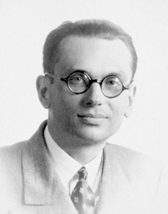

+++
title = "The beauty of math's incompleteness or how self-references can beautifully screw things up"
date = "2025-05-24T12:57:00"
author = "Jose Storopoli, PhD"

[taxonomies]
tags = ["math", "programming", "agda"]

[extra]
katex = true
+++

{{ katex() }}


> "Logic is the hygiene that the mathematician practises to keep his ideas healthy and strong."
> --- Hermann Weyl

I have a very special place for mathematics in my mind and heart.

Mathematics is above any other science.
This is because the knowledge we gather in all other sciences are never absolute true.
All other sciences are based on observations and experiments,
and eventually evidence accrues to a threshold that we can morally declare that something is true.
Yet, it is not mathematically true, in other words, for any given pile of evidence about a given hypothesis $H$,
we have $P(H) < 1$.
In a pure philosophical sense, we can never be absolutely sure about scientific hypotheses.
There will always be a certain degree of uncertainty even if we have a lot of evidence in favor of a given hypothesis.
For mathematical theorems, which is the meat of mathematics, once they are proven, they are absolute true,
i.e. $P(H) = 1$.
For example, imagine a galaxy very far away, and a million years from now, given the
[5 axioms of Euclidian geometry](https://en.wikipedia.org/wiki/Euclidean_geometry#Axioms),
the theorem that the sum of the angles of a triangle is 180 degrees will still be true.
It will always be true (given the 5 axioms of course).

That is how mathematics won my mind.
Now, how it won my heart is a different story.
It has to do with the beauty of math's incompleteness
and self-referential paradoxes.

## Cantor and multiple infinities


Let's go back to 1874, when [Georg Cantor](https://en.wikipedia.org/wiki/Georg_Cantor)
proved that there are multiple infinities.
Yes, that sounds crazy, but it is true.

Cantor is the father of set theory.
Before him, the concept of a set was just a collection of objects and they were all finite collections.
This dates back to Aristotle, and no one imagined that there was interesting things to say about sets.
In order to put set theory on a solid footing, Cantor had to define what a set is.
For finite sets, this was kinda trivial.
However, for infinite sets, this is where things started to get interesting.

Cantor started exploring the properties of infinite sets.
First, he analyzed the properties of the set of natural numbers $\mathbb{N}$.
He then realized that the set of natural numbers is the same size
as the set of the integers $\mathbb{Z}$ and the set of the rational numbers $\mathbb{Q}$.
To show this, he had to come up with a way to compare the sizes of sets.
He did this by defining a bijection between the set of natural numbers and the set of integers.
A bijection is a function that is one-to-one and onto.
In other words, it is a function that maps each element of the first set to a unique element of the second set,
and each element of the second set to a unique element of the first set.

For example, the function

$$
f(n) = \begin{cases}
    -\frac{n}{2} & \text{if } n \text{ is even} \\\\
    \frac{n+1}{2} & \text{if } n \text{ is odd}
\end{cases}
$$

is a bijection between the set of natural numbers and the set of integers.

It creates a one-to-one correspondence between the set of natural numbers and the set of integers:

| $f(n)$ | $\mathbb{N}$ | $\mathbb{Z}$ |
|--------|--------------|--------------|
| f(0)   | 0            | 0            |
| f(1)   | 1            | 1            |
| f(2)   | 2            | -1           |
| f(3)   | 3            | 2            |
| f(4)   | 4            | -2           |
| f(5)   | 5            | 3            |
| f(6)   | 6            | -3           |

Ok that was easy, we just proved that the set of natural numbers and the set of integers have the same size.
Now let's try to prove the same for the set of rational numbers $\mathbb{Q}$.
The idea again is to find a bijection between the set of natural numbers and the set of rational numbers.
We can represent the set of rational numbers as a grid of fractions:

$$
\begin{array}{cccc}
    \frac{1}{1} & \quad \frac{1}{2} & \quad \frac{1}{3} & \quad \cdots \\\\\\\\
    \frac{2}{1} & \quad \frac{2}{2} & \quad \frac{2}{3} & \quad \cdots \\\\\\\\
    \frac{3}{1} & \quad \frac{3}{2} & \quad \frac{3}{3} & \quad \cdots \\\\\\\\
    \vdots & \quad \vdots & \quad \vdots & \quad \ddots \\\\\\\\
\end{array}
$$

Now, we can't just go row by row or column by column - that would never finish the first row!
Instead, Cantor had a brilliant idea: traverse the grid diagonally in a zigzag pattern[^pairing-function].

[^pairing-function]: This is called a [pairing function](https://en.wikipedia.org/wiki/Pairing_function), and specifically the [Cantor pairing function](https://en.wikipedia.org/wiki/Cantor_pairing_function).

$$
\begin{array}{ccccc}
    \frac{1}{1} & \rightarrow & \frac{1}{2} & \quad & \frac{1}{3} & \rightarrow & \frac{1}{4} & \cdots \\\\
    & \swarrow & & \nearrow & & \swarrow & \\\\
    \frac{2}{1} & & \frac{2}{2} & & \frac{2}{3} & & \frac{2}{4} & \cdots \\\\
    \downarrow & \nearrow & & \swarrow & & & \\\\
    \frac{3}{1} & & \frac{3}{2} & & \frac{3}{3} & & \frac{3}{4} & \cdots \\\\
    & \swarrow & & \nearrow & & & \\\\
    \frac{4}{1} & & \frac{4}{2} & & \frac{4}{3} & & \frac{4}{4} & \cdots \\\\
    \vdots & & \vdots & & \vdots & & \vdots & \ddots \\\\
\end{array}
$$

This gives us the sequence:
$$
\frac{1}{1}, \frac{1}{2}, \frac{2}{1}, \frac{3}{1}, \frac{2}{2}, \frac{1}{3}, \frac{1}{4}, \frac{2}{3}, \frac{3}{2}, \frac{4}{1}, \ldots
$$

But wait! We have a problem --- many fractions represent the same rational number:
- $\frac{2}{2} = \frac{1}{1} = 1$
- $\frac{2}{4} = \frac{1}{2} = 0.5$

To create a true bijection, we need to skip these duplicates.
 We only keep fractions in **lowest terms**,
 where $\text{gcd}(\text{numerator}, \text{denominator}) = 1$.

After removing duplicates:
$$\frac{1}{1}, \frac{1}{2}, \frac{2}{1}, \frac{3}{1}, \frac{1}{3}, \frac{1}{4}, \frac{2}{3}, \frac{3}{2}, \frac{4}{1}, \ldots$$

Ok we're almost there. This is truly a bijection.
However, it is a bijection between $\mathbb{N}$ and the set of positive rationals $\mathbb{Q}^+$.
To include all of $\mathbb{Q}$, we interleave positive and negative rationals (and zero).
I won't give the precise mathematical formula here because it is a bit messy,
however here's an algorithm describing the bijection:

1. Start with $n$
2. If $n = 0$, return $0$
3. Otherwise:
   - Let $k = \frac{n+1}{2}$ if $n$ is odd, $k = \frac{n}{2}$ if $n$ is even
   - Find the $k$-th positive rational in our enumeration, call it $r$
   - If $n$ is odd, return $r$
   - If $n$ is even, return $-r$

This gives us the following bijection:

| $g(n)$ | $\mathbb{N}$ | $\mathbb{Q}^+$ enumeration  | $\mathbb{Q}$   |
|--------|--------------|-----------------------------|----------------|
| g(0)   | 0            | -                           | 0              |
| g(1)   | 1            | 1st positive: $\frac{1}{1}$ | 1              |
| g(2)   | 2            | 1st positive: $\frac{1}{1}$ | -1             |
| g(3)   | 3            | 2nd positive: $\frac{1}{2}$ | $\frac{1}{2}$  |
| g(4)   | 4            | 2nd positive: $\frac{1}{2}$ | $-\frac{1}{2}$ |
| g(5)   | 5            | 3rd positive: $\frac{2}{1}$ | 2              |
| g(6)   | 6            | 3rd positive: $\frac{2}{1}$ | -2             |

Q.E.D.! We have a bijection between $\mathbb{N}$ and $\mathbb{Q}$.

I went over all of these details because this diagonalization argument is a very important insight.
Any set that can be put in a one-to-one correspondence with the set of natural numbers is called countable.
Cantor showed that the set of rational numbers is countable.

Let's see what happens when we try to apply the same argument to the set of real numbers $\mathbb{R}$.
For the sake of simplicity, let's consider the set of real numbers between 0 and 1, $\mathbb{R}_{(0,1)}$.
Let's assume that we have a bijection $f$ between $\mathbb{N}$ and $\mathbb{R}_{(0,1)}$.
This would give us the following table:

| $f(n)$ | $\mathbb{N}$ | $\mathbb{R}_{(0,1)}$ |
|--------|--------------|----------------------|
| f(0)   | 0            | 0.011...             |
| f(1)   | 1            | 0.111...             |
| f(2)   | 2            | 0.112...             |
| ...    | ...          | ...                  |

Note that the real number $f(n)$ is the $n$-th real number in the list.

Now, let's construct a new real number $x$ that is not in the list.
We will do this by constructing a real number that is different from the $n$-th real number in the list for all $n$.
We just add 1 to the $n$-th digit of the $n$-th real number in the list.
For example, for the first real number in the list, we add 1 to the first digit,
for the second real number in the list, we add 1 to the second digit,
and so on.

This gives us the following real number: $0.123\ldots$
By construction, this real number is not in the list,
since it differs from the first real number in the list by 1 in the first digit,
from the second real number in the list by 1 in the second digit,
and so on.

This is a contradiction, since we assumed that $f$ was a bijection.

Now, this is where self-reference strikes first in this post,
and probably in the history of mathematics.
When we construct the diagonal number $x$, we're creating something that:

1. Refers to the entire supposed list of real numbers.
2. Defines itself in opposition to that list - "I differ from the 1st number at position 1, from the 2nd at position 2...".
3. Uses the list to prove the list is incomplete.

Ultimately, this is where Cantor found the first example of a set that is not countable.
There's no way to pair the set of natural numbers with the set of real numbers between 0 and 1.
Therefore, the set of real numbers between 0 and 1 is not countable.

This is a very important insight.
It shows that there are different sizes of infinity.
Yes, that is mind-blowing and paradoxically beautiful.

Cantor called the size of the set of natural numbers $\aleph_0$,
and conjectured that the set of real numbers is $\aleph_1$.
This is called the [continuum hypothesis](https://en.wikipedia.org/wiki/Continuum_hypothesis) (CH).

## Russel and the barber paradox


Now let's fast forward to 1901.
Set theory was still in its infancy,
yet it was starting to be accepted by the mathematical community.
This is where [Bertrand Russell](https://en.wikipedia.org/wiki/Bertrand_Russell)
after attending the first [World Congress of Philosophy](https://en.wikipedia.org/wiki/World_Congress_of_Philosophy) in Paris in 1900,
was impressed by the work of Peano who was using set theory to formalize mathematics.

He embarked on a journey to formalize mathematics using set theory.
However, he stumbled upon a paradox.
Set theory is very lenient with the definition of sets.
For example, we can define the set of all sets that are not members of themselves:

$$
R = \\{ x \mid x \notin x \\}
$$

Now what happens if we ask the question: is $R$ a member of itself?
If $R$ is a member of itself, then it is not a member of itself.
If $R$ is not a member of itself, then it is a member of itself.

To put more simply, Russell gave the simple analogy:
imagine a barber who shaves all men who do not shave themselves.
Now, the question is: does the barber shave himself?
If he does, then he does not shave himself.
If he does not shave himself, then he does shave himself.

I can even given an even more simple example: the statement "this statement is false" is a paradox.
If it is true, then it is false.
If it is false, then it is true.

Or suppose that I go out and shout out loud: "I am lying".
If I am lying, then I am not lying.
If I am not lying, then I am lying.

All of these examples boils down to the same thing:
we cannot have a set of all sets that are not members of themselves.

This is called the [Russell's paradox](https://en.wikipedia.org/wiki/Russell%27s_paradox).
And yet again, we have self-reference creating a paradox.
Personally, I find Cantor's multiple infinities more beautiful than Russell's paradox.
But I acknowledge that Russell's paradox is way simpler and more accessible to the general public.

## Gödel and the incompleteness theorem



Fasten your seatbelts, this is going to be a wild ride.
But first, a little bit of history.

In 1900,
during the second [International Congress of Mathematicians](https://en.wikipedia.org/wiki/International_Congress_of_Mathematicians) in Paris,
David Hilbert,
arguably the most important mathematician of the 20th century,
gave a list of 23 problems that he thought would be the most important to solve in the century.
These became known as the [Hilbert's problems](https://en.wikipedia.org/wiki/Hilbert%27s_problems).
Right there in the second problem, Hilbert asked:

> The compatibility of the arithmetical axioms.

Later, Hilbert recasted his "Second Problem" at the eighth [International Congress of Mathematicians](https://en.wikipedia.org/wiki/International_Congress_of_Mathematicians) in Bologna.
He posed three questions:

1. Was mathematics complete?
2. Was mathematics consistent?
3. Was mathematics decidable?

Hilbert believed that mathematics could be put on a completely secure foundation by answering these questions.
Gödel would shatter the dream of a complete and consistent mathematics.
And later, Turing would show that mathematics is not decidable.

Gödel's incompleteness theorems[^godel-incompleteness] are composed of two theorems.
Let's start with the first incompleteness theorem, which Gödel proved in 1931
in front of an audience that comprised of no one other than [Von Neumann](@/blog/2024-06-22-von-neumann/index.md),
who allegedly was so impressed by Gödel's work that he remarked:

> It's all over.

[^godel-incompleteness]: If you really want to dive deep into the details of Gödel's incompleteness theorem, check out [Gödel Without (Too Many) Tears](https://www.logicmatters.net/igt/#A-shorter-book) by the logician Peter Smith.

### The first incompleteness theorem

The First Incompleteness Theorem states:

> For any consistent formal system $F$ that is powerful enough to express basic arithmetic[^peano], there exists a statement $G$ in the language of $F$ such that:
>
> 1. $G$ is true (when interpreted as a statement about natural numbers)
> 2. $G$ cannot be proven within $F$
> 3. $\neg G$ (not $G$) cannot be proven within $F$ either

[^peano]: Another rabbit hole to dive: [Peano's arithmetic](https://en.wikipedia.org/wiki/Peano_arithmetic).

In other words: truth and provability are not the same thing!

Gödel's genius was realizing he could make mathematical statements talk about mathematical statements.

#### Step 1: Gödel numbering --- the encoding trick

Gödel assigned a unique natural number to every mathematical symbol, expression, and proof.
Think of it like ASCII encoding for math:

Basic symbols get prime numbers:

- `0` → 2
- `=` → 3
- `+` → 5
- `(` → 7
- `)` → 11
- etc.

Gödel used a system based on prime factorization.
He first assigned a unique natural number to each basic symbol in the formal language of arithmetic with which he was dealing.

To encode an entire formula, which is a sequence of symbols, Gödel used the following system.
Given a sequence $(x_{1},x_{2},x_{3},...,x_{n})$ of positive integers,
the Gödel encoding of the sequence is the product of the first $n$ primes raised to their corresponding values in the sequence
For example, the formula $0 = 0$ might become:

- `0` → 2
- `=` → 3
- `0` → 2

Gödel number = $2^2 \times 3^3 \times 5^2 = 4 \times 27 \times 25 = 2,700$

This is called the [Gödel numbering](https://en.wikipedia.org/wiki/G%C3%B6del_numbering).
The key insight is that now statements about formulas become statements about numbers!

#### Step 2: the predicate "proves(x, y)"

Using Gödel numbering, we can write an arithmetic predicate that means:
"$x$ is the Gödel number of a proof of the statement with Gödel number $y$"

This is purely mechanical --- checking if $x$ represents a valid sequence of logical steps ending in $y$.

#### Step 3: the diagonal lemma --- the self-reference trick

This is where it gets mind-blowing.
Gödel proved:

> For any arithmetic property $P(x)$, we can construct a statement $S$ that says:
> "$P$ holds for my own Gödel number"

It's like writing a sentence that says "This sentence has 25 letters" --- but in arithmetic!

How The Diagonal Lemma works:

1. Define a function $\text{sub}(n, m) =$ "the result of substituting $m$ into formula $n$".
2. Consider the property: "The formula with Gödel number $x$, when $x$ substituted into it, has property $P$".
3. Let this property have Gödel number $d$.
4. Now look at $\text{sub}(d, d)$ --- this is $d$ applied to itself!

This creates a fixed point --- a statement that successfully refers to itself.

#### Step 4: constructing $G$ --- the Gödel sentence

Using the diagonal lemma with the property "is not provable", Gödel constructs $G$ such that:

$G \iff \text{"The statement with Gödel number $g$ is not provable"}$

But $g$ is the Gödel number of $G$ itself! So:

$G \iff \text{"$G$ is not provable"}$

Now we reason:

Case 1: Suppose G is provable:

- Then G is false (since G says "G is not provable")
- So our system proves a false statement
- The system is inconsistent! ❌

Case 2: Suppose $\neg G$ is provable:

- Then G is true (G really isn't provable)
- So $\neg G$ is false
- Again, the system proves something false
- Inconsistent! ❌

Conclusion: If the system is consistent:

- Neither $G$ nor $\neg G$ is provable
- But $G$ is true (it correctly states its own unprovability)
- We have a true but unprovable statement! ✅

This is the self-reference that Gödel uses to prove his first incompleteness theorem.

The deepest insight is that self-reference is unavoidable in any system strong enough to do arithmetic.
Once you can:

1. Encode statements as numbers
2. Talk about properties of those numbers
3. Use diagonalization

You automatically get statements that assert their own unprovability.
Mathematics contains the seeds of its own incompleteness!

### The second incompleteness theorem

The Second Incompleteness Theorem states:

> If $F$ is a consistent formal system capable of proving basic arithmetic facts, then $F$ cannot prove its own consistency.

This means arithmetic cannot prove that arithmetic doesn't contradict itself!
It's like a judge who can't certify their own sanity --- the very act of self-certification is suspect.

The Second Theorem is actually a clever consequence of the First. Here's the brilliant insight:

#### Step 1: formalizing "consistency"

First, we need to express "$F$ is consistent" in the language of arithmetic.
Gödel realized:

> "$F$ is consistent" $\iff$ "$F$ does not prove both a statement and its negation"

Using Gödel numbering, this becomes:
$\text{Consistency}(F) = \text{"There is no statement A such that F proves both A and ¬A"}$

Or equivalently:
$\text{Consistency}(F) = \text{"F does not prove 0=1"}$ (since from a contradiction, you can prove anything)

#### Step 2: the key connection

Remember our Gödel sentence $G$ from the First Theorem:

$G \iff \text{"$G$ is not provable in $F$"}$

Now here's the brilliant move.
Gödel proved that within $F$ itself:

> $F$ can prove: "If $F$ is consistent, then $G$ is not provable"

Now comes the devastating logic:

1. Assume $F$ can prove its own consistency: $F \vdash \text{Con}(F)$
2. We know $F$ can prove: $\text{Con}(F) \rightarrow G$
3. By deduction: $F \vdash G$
4. But this means $G$ is provable!
5. Since $G$ says "$G$ is not provable", $G$ must be false
6. So $F$ proves a false statement - $F$ is inconsistent!

We've shown: If $F$ can prove its own consistency, then $F$ is inconsistent!
Therefore: If $F$ is consistent, it cannot prove its own consistency

---

That's a lot to digest.
This is a very deep result that is still being studied today.
I find this result to be on par with Cantor's multiple infinities in beauty.
However, Gödel's incompleteness theorems are a much more outstanding and impressive result.

## Turing and the halting problem


Hilbert, after being aware of Gödel's incompleteness theorems,
was devastated.
His beautiful dream of a complete and consistent mathematics was shattered.
But there were still hope in the idea of mathematics being decidable.

Alan Turing, in 1936, while still an undergraduate at King's College, Cambridge,
published a paper entitled "On Computable Numbers, with an Application to the Entscheidungsproblem".
That mouthful word, Entscheidungsproblem, is the German for what has become known as the
["halting problem"](https://en.wikipedia.org/wiki/Halting_problem).

The halting problem is the problem of determining whether a program will halt or run forever.
Turing showed that the halting problem is undecidable,
thus shattering the last bastion of hope for a complete, consistent, and decidable mathematics.

### The Turing machine

To tackle the halting problem,
Turing introduced the concept of the [Turing machine](https://en.wikipedia.org/wiki/Turing_machine).
A Turing machine is a mathematical model of a computer that can be used to compute anything.
It is comprised of a tape, a head, and a set of rules.
The tape is infinite in both directions, and is divided into cells.
The head can read and write symbols on the tape.
The rules are a set of instructions that the head can follow.
He showed that any computable function can be computed by a Turing machine.
I won't go into much details here,
since if you are reading this through the internet,
holding on your hands or standing in front of a "Turing machine",
is proof enough that Turing machines can compute stuff.

Using the newfound concept of the Turing machine,
Turing then redefined the concept of the halting problem:

> Given a Turing machine $M$ and input $I$, will $M$ eventually halt (stop) on input $I$, or will it run forever?

To answer this question,
suppose that you have a function that detects if a Turing machine halts on a given input.
Here's how the function signature looks like in Haskell notation:

```haskell
halts :: TuringMachine -> Input -> Bool
```

This function takes a Turing machine and an input,
and returns a boolean value indicating whether the Turing machine halts on the input.

Now, let's say that you have a Turing machine $M$ that uses the `halts` function to detect whether a Turing machine halts on a given input.
However, this machine loops forever if the `halts` function returns `True`,
or halts if the `halts` function returns `False`.
This could be expressed in Haskell as:

```haskell
M :: TuringMachine -> Input -> ()
M m i = if halts m i then loop else ()
```

Now, the question is:

> Does $M$ halt on input $M$?

If $M$ halts on input $M$,
then $M$ loops forever.
If $M$ loops forever,
then $M$ halts on input $M$.

We have arrived at a contradiction and the final self-referential paradox in this blog post.

That's how Turing, at the young age of 24,
proved that mathematics is not decidable.

## Side rant about Turing and computers

Turing was not much interested in computers.
He was interested in the foundations of mathematics.
He was interested in the foundations of logic.
And many other mathematical problems.
In thinking about how to prove the decidability of mathematics,
he came up with a platonic machine that could compute anything.
This machine is now known as the [Turing machine](https://en.wikipedia.org/wiki/Turing_machine).
It is comprised of a tape, a head, and a set of rules.
The tape is infinite in both directions.
The head can read and write symbols on the tape.
The rules are a set of instructions that the head can follow.
Now, you know who was into computers?
John von Neumann.
When asked after the unveiling of the atomic bomb and the work at Los Alamos,
what he was doing,
he said:

> I am working with something way more powerful than the atomic bomb: Computers.

Most computers today use what we call the [Von Neumann architecture](https://en.wikipedia.org/wiki/Von_Neumann_architecture),
and Von Neumann built several computers in the 1940s.
